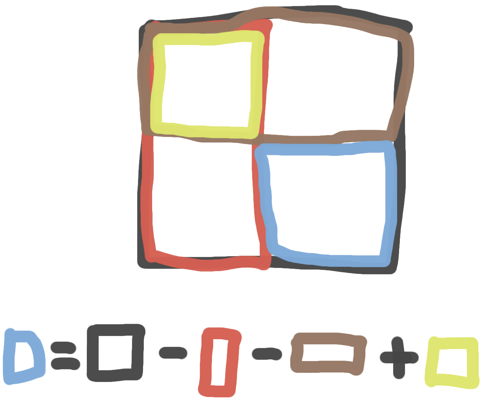

# 11660 구간 합 구하기 5

[](https://www.acmicpc.net/problem/11660)

## 문제 조건

- 1 ≤ N ≤ 1024, 1 ≤ M ≤ 100,000
- 표에 채워져 있는 수는 1,000보다 작거나 같은 자연수다.(X1 ≤ X2, Y1 ≤ Y2)

## 풀이 과정

누적 합 배열을 구한 뒤 D[x2][y2] - D[x1-1][y2] - D[x2][y1-1] + D[x1-1][y1-1]으로 구간 합을 구했습니다
(대충 큰거에서 긴거 두개빼고 작은거 더한그림).



구하려는 구간을 구하는 식을 그렸는데 난해한 그림인듯..

```java
/**
 * 11660 구간 합 구하기 2
 *
 * n(표의 크기), m(질의 개수) 저장하기
 * for(n만큼 반복) {
 *     for(n만큼 반복) {
 *         원본 배열 저장하기
 *     }
 * }
 * for(n만큼 반복) {
 *     for(n만큼 반복) {
 *         합 배열 저장하기
 *         D[i][j] = D[i-1][j] + D[i][j-1] - D[i-1][j-1] + A[i][j]
 *     }
 * }
 * for(m만큼 반복) {
 *     질의 계산 및 출력하기
 *     result = D[x2][y2] - D[x2][y1-1] - D[x1-1][y2] + D[x1-1][y1-1]
 * }
 */
class Main
{
    public static void main(String[] args) throws IOException {
        BufferedReader br = new BufferedReader(new InputStreamReader(System.in));
        StringTokenizer st;

        st = new StringTokenizer(br.readLine());
        int n = Integer.parseInt(st.nextToken());
        int m = Integer.parseInt(st.nextToken());

        int[][] A = new int[n+1][n+1];
        int[][] D = new int[n+1][n+1];

        for(int i=1; i<=n; i++) {
            st = new StringTokenizer(br.readLine());
            for(int j=1; j<=n; j++) {
                A[i][j] = Integer.parseInt(st.nextToken());
            }
        }

        for(int i=1; i<=n; i++) {
            for(int j=1; j<=n; j++) {
                D[i][j] = D[i-1][j] + D[i][j-1] - D[i-1][j-1] + A[i][j];
            }
        }

        for(int i=0; i<m; i++) {
            st = new StringTokenizer(br.readLine());
            int x1 = Integer.parseInt(st.nextToken());
            int y1 = Integer.parseInt(st.nextToken());
            int x2 = Integer.parseInt(st.nextToken());
            int y2 = Integer.parseInt(st.nextToken());

            int result = D[x2][y2] - D[x1-1][y2] - D[x2][y1-1] + D[x1-1][y1-1];
            System.out.println(result);
        }
    }
}
```